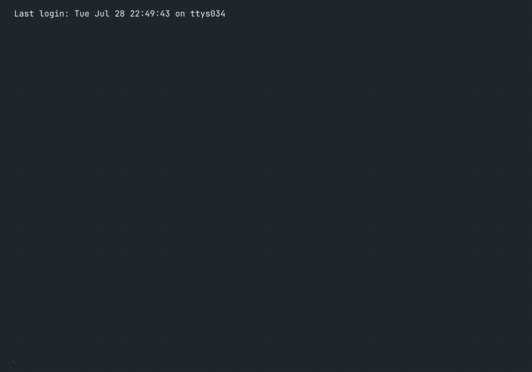

<p align="center">
  <a href="https://mere.run"></a>
</p>

<p align="center">
  <a href="https://mere.run">mere.run</a> ·
  <a href="https://docs.mere.run/">Documentation</a> ·
  <a href="docs/cli.md#overview">Command reference</a> ·
  <a href="https://mere.run/releases">Downloads</a> ·
  <a href="https://relay.mere.run">Relay and nodes</a> ·
  <a href="https://plugins.mere.run">Plugins</a>
</p>

# mere.run

mere.run is a local AI runtime for developers and creators. Use its command-line
interface (CLI) to generate media, run language models, and analyze images or
geospatial data. You can also train adapters, evaluate models, serve an
OpenAI-compatible API, and run portable workflow graphs.

Apple Silicon macOS is the primary platform. Headless Linux CUDA packages are
also available. The macOS Studio app uses the same CLI, model store, and run
history. The iOS client connects to your machines and offers experimental
image and chat inference on supported iPhones.

<p align="center">
  
</p>

The demonstration shows a local terminal session on an M4 Max. The workflows
include chat, image generation, grounding, 3D reconstruction, sound, speech,
video, API serving, and a workflow graph.

## Start here

[Install the CLI](#install-or-build) before running the examples. To choose a
guided agent setup or a manual setup path, run:

```bash
mere.run setup
```

Before downloading models, check your installed version, the machine's model
recommendations, and the offline guides:

```bash
mere.run --version
mere.run model capabilities --recommended
mere.run guide --list
```

For every public command and subcommand, see the
[complete command reference](./docs/cli.md#overview). Repository tests check
its generated tree against the CLI. For flags in your installed version,
run `mere.run COMMAND --help`. Replace `COMMAND` with a command path, such as
`image generate`.

To generate your first image:

1. Review the model download plan:

   ```bash
   mere.run model pull image-zimage-nano --preflight --json
   ```

2. Download the model:

   ```bash
   mere.run model pull image-zimage-nano
   ```

3. Generate `mug.png` in your working directory:

   ```bash
   mere.run image generate \
     --model image-zimage-nano \
     --prompt "a ceramic mug in soft morning light" \
     --output ./mug.png
   ```

Model sizes, memory requirements, and licenses vary. Before downloading a
model, review its [catalog entry](./docs/model-sources.md) and run a pull
preflight. After installation, `mere.run model info MODEL_ID` reports the
model's manifest and validation status. Replace `MODEL_ID` with its catalog ID.
Local inference doesn't require a hosted inference service after the models
are installed.

## Release status

On August 29, 2026, the published release was
[v0.46.1](https://github.com/sawfwair/mere-run/releases/tag/v0.46.1).
The following sections summarize current and previous release packages.

Model names use Q2, Q4, and Q8 for 2-bit, 4-bit, and 8-bit quantization.
BF16 refers to bfloat16, a 16-bit floating-point format.

### Release v0.46.1

- Restored image inference for the optimized Qwen3.8 27B Q4 package by adding
  its pinned official vision component without replacing the optimized text
  target or MTP companion.
- Restored LTX 2.3 text-to-video and audio-to-video loading while preserving
  the separate LTX 2.5 checkpoint layout.

### Release v0.46.0

- Flash-Next Qwen Sparse Attention (QSA) beyond the earlier 2,048-token limit,
  plus the public `vision-chat-q38-flash-next-3bit` activation-weighted Q3
  profile and memory, cache, vision, and verification fixes.
- Image inputs and structured JSON object responses in external evaluation
  packs, with content-pinned images and strict schema validation.
- Verified installation, execution, and rollback for signed macOS Apple
  Silicon plugin bundles supplied through an explicit source.
- Faster Qwen3.8 27B Q4 multi-token prediction (MTP) with exact greedy output
  parity in the bounded release benchmark. BF16 MTP remains opt-in.

### Release v0.45.0

- Qwen3.8-Flash-Next packages in mixed Q2/Q4 and Q4 precision, with verified
  multi-token prediction (MTP) for greedy decoding.
- A complete LTX 2.5 distilled bundle with a Q4 text encoder. The runtime
  releases conditioning models early and decodes video in tiles to limit memory
  use.
- Faster model inventory for API clients.

### Release v0.44.0

- SenseNova U1.5 image generation and editing.
- MiniMax Music 3 local composition and `q8-lm` and `q4-lm` precision modes.
- Additional LiquidAI LFM2.5 quantized models and
  DSpark companions for speculative decoding. The
  [model catalog](./docs/model-sources.md) describes these variants.
- Improvements to Nemotron tool calls, text training templates, and Gemma 4
  Turbo API serving.

### Qwen3.8 Flash Next qualification notes

Release v0.46.0 adds Flash-Next Qwen Sparse Attention (QSA) beyond the earlier
2,048-token limit for the prompt and generated response combined. It also adds
the public, ungated
`vision-chat-q38-flash-next-3bit` activation-weighted Q3 profile. Its 89.67 GB
managed pull requires explicit Qwen Community License 1.0 acceptance. Qwen3.8
27B also has MTP decoding improvements. Its MTP path remains opt-in.

The Flash-Next mixed and Q3 models target Macs with 128 GB of memory. The Q4
package requires more memory. The architecture's context limit is 262,144
tokens, but that full length hasn't been qualified on the 128 GB profiles.
Usable context depends on memory for weights, key/value caches, and MTP
history.

The Q3 checkpoint's sealed holdout matched the pinned Q4 output on all 16
cases, including eight image and OCR cases. These bounded checks don't
establish general model quality or BF16 parity. For implementation details and
validation limits, see the [release notes](./CHANGELOG.md) and
[Qwen runtime guide](./Sources/MereRunCore/Q35/README.md).

## What you can do

Use the following table to choose a workflow. Each guide lists model IDs,
prerequisites, examples, and limits. Available inputs and controls depend on
the selected model.

Some workflows use low-rank adaptation (LoRA) to train small adapters instead
of updating all model weights.

| Area | Commands | Capabilities |
| --- | --- | --- |
| [Text, code, and agents](./docs/runtime/text.md) | `text chat`, `text code`, `text embed`, `text anonymize`, `agent` | Chat, code generation, tool calls, structured responses, embeddings, and personal information redaction. Models include Gemma 4, Qwen3.8, LFM2.5, Laguna, Inkling, Nemotron Lightning, DeepSeek V4 Flash, and Ornith. |
| [Multimodal chat](./docs/runtime/text.md) | `text chat`, `vision caption`, `vision inspect`, `vision embed` | Image understanding with Gemma, Qwen, LFM, Bonsai, and Muse Glimmer. Nemotron Nano Omni also supports audio and video understanding. Shared text and image embeddings support retrieval. |
| [Images](./docs/runtime/image.md) | `image generate` | Generation and editing with Klein, ZImage, HiDream O1, SenseNova U1.5, Krea 2, Qwen Image Edit 2511, Ideogram 4, and Bonsai. Controls include ordered references, structured prompts, and LoRA adapters. |
| [Video](./docs/runtime/video.md) | `video generate`, `video session`, `video animate`, `video prepare-masks` | Synchronized audio and video with LTX 2.5 and 2.3. MiniMax-H3 supports keyframes and ordered media references. Other workflows include Wan 2.2 generation and SCAIL-2 subject animation with SAM masks. |
| [Worlds](./docs/runtime/world.md) | `video cosmos3`, `world serve` | Cosmos3-Edge generation, visual reasoning, and learned-action dynamics. DreamX and Cosmos3 support persistent world sessions. |
| [Music](./docs/runtime/music.md) | `music generate`, `music analyze`, `music realtime`, `music transcribe`, `music serve` | MiniMax Music 3 songs and composition. ACE-Step generation, covers, and editing. Magenta RT2 realtime MIDI performance and MuScriptor transcription of full mixes into MIDI. |
| [Sound effects](./docs/runtime/sfx.md) | `sfx generate`, `sfx video generate`, `sfx clap`, `sfx ae` | Woosh and MMAudio generation conditioned on text or video. Text and audio similarity scoring, plus audio latent encoding and decoding. |
| [Speech](./docs/runtime/speech.md) | `speech synthesize`, `speech transcribe`, `speech listen`, `speech diarize`, `speech profile` | Qwen3 speech synthesis, saved voice profiles, Qwen3 and Parakeet transcription, live microphone input, and Sortformer speaker timelines. |
| [Audio generation and restoration](./docs/runtime/audio.md) | `audio enhance`, `music separate`, `audio generate` | AP-BWE speech bandwidth extension and UniverSR audio super-resolution. RoFormer stem separation, reverb removal, and noise removal. LTX 2.5 text-to-audio generation. |
| [Vision](./docs/runtime/vision.md) | `vision ground`, `vision segment`, `vision track`, `vision face`, `vision pose`, `vision flow`, `vision ocr` | Falcon object grounding, SAM 3.1 masks and tracking, face analysis, body, hand, and face landmarks, and optical flow. LightOn, GLM, and Infinity extract text from images. |
| [Depth and 3D](./docs/runtime/vision.md) | `vision depth-video`, `vision geometry`, `vision geometry-multiview`, `image reconstruct-3d`, `image reconstruct-3d-trellis2`, `image reconstruct-3d-multiview` | Depth, cameras, point clouds, meshes, and materials for physically based rendering. Models include Video Depth Anything, MoGe-2, Depth Anything 3, TripoSR, TRELLIS.2, and InstantMesh. |
| [Geospatial inference](./docs/runtime/geo.md) | `geo flood`, `geo fire`, `geo tessera`, `geo olmoearth` | TerraMind flood and fire class scores, TESSERA v2 Sentinel time-series embeddings, and OlmoEarth v1.2 multisensor spatial embeddings from prepared tensors. |
| [Training and adapters](./docs/cli.md) | `image train-lora`, `text train-lora`, `music train-adapter`, `adapter` | Local image, text, and music adapter training, named recipes, checkpoints, and public adapters verified by checksum. Support varies by model family. |
| [Evaluation](./docs/evaluation-packs.md) | `eval pack validate`, `eval run`, `eval promote`, `model benchmark`, `gate` | External text-chat and image-conditioned VLM evaluation packs, structured responses, matched model and adapter runs, resumable reports, promotion receipts, benchmarks, and installed-model checks. |
| [API serving](./docs/runtime/api-server.md) | `api serve`, `open-webui quickstart`, `model runtime`, `status` | OpenAI-compatible chat, embeddings, images, and speech, plus native vision routes. Model loading and pinning, idle expiry, memory limits, and runtime telemetry. |
| [Portable workflows](./docs/workflows.md) | `graph`, `executor`, `relay`, `run` | Typed graphs and immutable job bundles for local, SSH, or relay execution. Resumable runs, progress events, verified artifact downloads, cancellation, and retry. |

Geospatial commands accept prepared tensors. Your workflow remains responsible
for raster acquisition, reprojection, tiling, georeferencing, and evidence
review. Some checkpoints require the documented conversion step before native
inference. Predictions remain candidates for review.

The `vision track-live` command records a camera clip before tracking it. It
doesn't run live frame-by-frame inference. Evaluation pack validation and
promotion receipts verify the declared pack and report checks. They don't
establish general model quality or operational approval.

For generated examples, see the [showcase](https://mere.run/#showcase).
Runtime support doesn't grant permission to use or redistribute a checkpoint.
Review the [model sources and licenses](./docs/model-sources.md) for those terms.

## Example workflows

These examples use the installed CLI. From a source checkout, replace
`mere.run` with `swift run mere.run`. Supply your own input files, such as
`reference.png`. Model pulls download weights, and generation commands write
the named outputs.

### Chat locally

To download the Gemma model and stream a response:

1. Install the model:

   ```bash
   mere.run model pull text-chat-gemma4-12b-4bit
   ```

2. Send a prompt:

   ```bash
   mere.run text chat \
     --model text-chat-gemma4-12b-4bit \
     --stream \
     --prompt "Explain unified memory for local inference."
   ```

The response appears in the terminal. To connect an agent, run
`mere.run agent onboard`. For Pi installation, other agent clients, and tool
permissions, see the [agent guide](./docs/getting-started.md#agent-commands).

### Edit an image with SenseNova U1.5

Place an input image named `reference.png` in your working directory, then
follow these steps:

1. Install the model:

   ```bash
   mere.run model pull image-sensenova-u1-5-8b-mot
   ```

2. Generate an edited image named `sensenova-edit.png`:

   ```bash
   mere.run image generate \
     --model image-sensenova-u1-5-8b-mot \
     --input ./reference.png \
     --prompt "Turn this reference into a cinematic rainy-night scene" \
     --output ./sensenova-edit.png
   ```

For multiple references, structured prompts, Krea and Klein LoRA training, and
3D reconstruction, see the [image guide](./docs/runtime/image.md).

### Compose a song with MiniMax Music 3

This workflow uses a chat model to plan the song and a music model to generate
the audio. First, install Gemma as described in [Chat locally](#chat-locally).
Review the music model's terms and memory requirements before downloading it.

1. Install MiniMax Music 3 after accepting its terms:

   ```bash
   mere.run model pull music-minimax-music3 --accept-license-terms
   ```

2. Compose and generate `song.wav`:

   ```bash
   mere.run music generate \
     "slow-burn dream pop about leaving a familiar city and finding home" \
     --model music-minimax-music3 \
     --compose \
     --composer-model text-chat-gemma4-12b-4bit \
     --require-composer-installed \
     --duration 180 \
     --lyrics-preflight strict \
     --performance-mode q8-lm \
     --sampling-tier fast \
     --output ./song.wav
   ```

The command also saves composition metadata. The
`--require-composer-installed` option prevents an implicit composer download,
and `--lyrics-preflight strict` enables strict lyric-duration checks.
The `q8-lm` mode quantizes the global language model while retaining the
residual-depth decoder in BF16.

For supplied lyrics, ACE-Step covers, stem separation, MIDI transcription, and
realtime performance, see the [music guide](./docs/runtime/music.md).

### Generate synchronized video and audio

Review the LTX model's terms and memory requirements before downloading it.
Then follow these steps:

1. Install the complete distilled bundle after accepting its terms:

   ```bash
   mere.run model pull video-ltx25-distilled-bf16 --accept-license-terms
   ```

2. Generate an MP4 file with video and audio:

   ```bash
   mere.run video generate \
     "a small red robot walks across a wooden table, tiny mechanical footsteps" \
     --model video-ltx25-distilled-bf16 \
     --quality final \
     --output-mode audio-video \
     --fps 24 \
     --output ./robot.mp4
   ```

The bundle uses BF16 weights for the video pipeline and a Q4 text encoder.
For the checksum-pinned MiniMax-H3 LightX2V 8-step workflow, MiniMax-H3
references, long-form generation, the full LTX pipeline, source audio, and
SCAIL subject animation, see the [video guide](./docs/runtime/video.md).

### Serve the local API

Install Gemma as described in [Chat locally](#chat-locally) before starting the
server. The following procedure uses a loopback address, which accepts
connections from the serving machine:

1. Inspect the serving plan without starting the server:

   ```bash
   mere.run api serve \
     --engine text-chat-gemma4 \
     --model text-chat-gemma4-12b-4bit \
     --preflight --json
   ```

2. Start the server:

   ```bash
   mere.run api serve \
     --engine text-chat-gemma4 \
     --model text-chat-gemma4-12b-4bit
   ```

3. In another terminal, send a chat request:

   ```bash
   curl http://127.0.0.1:8080/v1/chat/completions \
     -H 'Content-Type: application/json' \
     --data '{
       "model": "text-chat-gemma4-12b-4bit",
       "messages": [{
         "role": "user",
         "content": "Explain local inference in one sentence."
       }]
     }'
   ```

The server returns a JSON response containing the model's answer. To stop the
server, press <kbd>Control+C</kbd> in its terminal.

When their models are installed, the server also exposes embeddings, image
generation and editing, speech, and native vision routes. The `/v1/models`
endpoint reports capabilities, tool support, input modalities, and active
limits. For authentication, model residency, and batching, see the
[API guide](./docs/runtime/api-server.md). For a chat interface, see the
[Open WebUI setup guide](./docs/runtime/api-server.md#open-webui-companion).

## Apps and execution across machines

Choose an interface based on where you want to create and run work:

| Surface | Execution location | Main functions |
| --- | --- | --- |
| [macOS Studio](./apps/macos/README.md) | The local CLI or configured executors | Media creation, training, a local artifact library, run inspection, model management, API serving, and agents. Command previews and logs remain available. |
| [iOS Studio](./docs/ios-studio.md) | A paired machine, a relay fleet, or selected iPhones | Job submission, progress monitoring, verified artifact downloads, Live Activities, and experimental local image and chat inference. |
| [Graph Studio](./docs/graph/studio.md) | A configured executor | Visual authoring for portable workflows. |
| [Relay and executors](./docs/workflows.md) | Local, SSH, relay fleet, or direct machine | Execution of the same job bundle across supported hosts. Credentials and machine-specific settings stay outside the bundle. |

Local iPhone models depend on device memory. Simulator builds don't establish
physical-device inference or lifecycle behavior. Graph Studio also has separate
runtime and file-format versions: Graph v2 uses `schema_version: 1` workflow
files.

The separate [Relay and Node project](https://relay.mere.run) manages fleet
hosts. [Official plugins](https://plugins.mere.run) add companion workflows and
typed graph providers outside the inference process. To inspect an available
plugin without installing it, run:

```bash
mere.run plugin list
mere.run plugin info mere-vfx-tools
```

Relay and Node source lives in `sawfwair/relay-mere-run`. Plugin contracts and
source live in [mere-run-plugins](https://github.com/sawfwair/mere-run-plugins).
This repository provides the local runtime and clients, not a hosted inference
backend. Remote execution sends work to the machine or fleet you select.
Local execution keeps the work on your device.

## Model storage

The default macOS model store is
`~/Library/Application Support/MereRun/models`. To select a different writable
store, set `MERERUN_MODELS_DIR` or pass `--models-root`. For example, this command
lists models in a store on an external volume:

```bash
mere.run --models-root /Volumes/Models/mere-run model list
```

To register models already organized as `MODEL_ROOT/MODEL_ID`, add their root
with `model location add`. This example uses `/Volumes/Models` as `MODEL_ROOT`:

```bash
mere.run model location add /Volumes/Models
mere.run model location list
```

The registration adds a read-only search root. Model pulls continue to write
to the primary store. An explicit store override doesn't include registered
roots.

To inspect disk usage and preview cache cleanup without deleting files, run:

```bash
mere.run model storage
mere.run model gc
```

The `model gc` command only prints a plan unless you pass `--force`. The
`model remove` command reclaims backing files only when no other model link
uses them. Its `--keep-cache` option retains those files.

Model pulls use a separate Hugging Face snapshot cache. To choose its location,
set `MERERUN_HUB_CACHE` or pass `--cache-dir` to `model pull`. Keep an external
cache volume connected while using models that link to its files.
For resolution order and cache details, see
[model management](./docs/runtime/model-management.md) and
[configuration](./docs/configuration.md).

## Automation and command discovery

For agents, scripts, and other clients, inspect the capability metadata and
command guides:

```bash
mere.run catalog --json
mere.run guide video generate
mere.run video --help
```

On commands that support preflight, `--preflight --json` reports a plan before
loading a model or writing output. The `--progress-json` option provides
structured progress on supported commands. Check the command's help for
available options.

Portable workflows preserve immutable plans, checksums, events, and run
directories. To inspect or retrieve work, use `run list`, `run inspect`,
`run watch`, and `run fetch`.

## Install or build

Choose the installation instructions for your platform. For workflows that
use FFmpeg, make `ffmpeg` and `ffprobe` available on `PATH`.
The `MERERUN_FFMPEG` and `MERERUN_FFPROBE` variables accept absolute paths to
those executables.

### Install on macOS

Use an Apple Silicon Mac with macOS 15 or later:

1. Download the signed disk image from the
   [release downloads](https://mere.run/releases).
2. Open the disk image.
3. Drag `MereRun.app` to the **Applications** folder.
4. In the app's **Settings**, install the optional `mere.run` terminal command.
   You can also install the `use-mere-run` skill there.

The app runs its bundled CLI even if you don't install the terminal command.
For a terminal-only installation, run the installer after mounting the disk
image:

```bash
cd /Volumes/mere.run/.mere-run
./install.sh
```

The installer places the CLI and its runtime assets in `/usr/local/bin`. It
uses `sudo` only if the destination requires it. For app integrations, see the
[preview and Library import deep links](./docs/macos-deep-links.md) and the
[Raycast integration](./docs/raycast.md).

### Install on Linux

Linux packages contain the headless CLI and runtime assets, not macOS Studio.
Release v0.46.1 provides CUDA x86_64 tarballs and Debian packages. Its release
smoke test ran on an RTX 3080 Ti with Ubuntu 24.04. Hosted CPU tests and that
CUDA test don't establish every model's compatibility on every Linux host.

For dependencies, CUDA setup, packaging, and validation limits, see the
[Linux quickstart](./docs/linux-quickstart.md).

### Build from source

The package uses Swift tools 6.0 and declares macOS 15 and iOS 18 platforms.
For development on Apple Silicon macOS:

1. Install the validation tools:

   ```bash
   brew install swiftlint ripgrep
   ```

2. From the repository root, build the package:

   ```bash
   swift build
   ```

3. Run the tests:

   ```bash
   swift test
   ```

4. Inspect the CLI:

   ```bash
   swift run mere.run --help
   ```

To build and open the optional macOS app, run:

```bash
app_path="$(./scripts/build_mere_run_app.sh debug)"
open "$app_path"
```

Before opening a pull request, run `./scripts/check.sh`. To add runtime smoke
tests, set `MERERUN_RUN_E2E=core` or `MERERUN_RUN_E2E=installed`.
Installed-model checks require the relevant assets and hardware.

To build the documentation, use Node.js 20 or later and the pnpm version
pinned in `package.json`:

```bash
pnpm install --frozen-lockfile
bash ./scripts/check-docs-examples.sh
pnpm docs:build
```

For contribution requirements and platform-specific work, see
[contributing](./CONTRIBUTING.md), [testing](./docs/testing.md), and the
[iOS build instructions](./apps/ios/README.md).

## Security defaults

The default configuration requires explicit opt-in for higher-risk behavior:

- API serving binds to loopback by default. Other addresses require
  `MERERUN_API_KEY` or `--api-key`. Configure authentication and rate limits
  before exposing the server. Use the environment variable to keep the key
  out of process arguments.
- Chat tools require interactive approval unless non-shell tools are explicitly
  approved for automatic execution. Shell execution is off by default and still
  requires interactive approval when enabled. File writes stay in the tool
  sandbox unless absolute paths are explicitly permitted.
- The server operator controls API LoRA selection. Requests can't supply
  adapter paths. Remote model and adapter downloads reject plaintext HTTP
  except for loopback and local development.
- Model licenses are separate from the runtime license. Before passing
  `--accept-license-terms` or its alias `--accept-model-license`, review the
  model's terms. Some models restrict commercial use or particular applications.
- External evaluation scorers require `--allow-external-scorer`. Before
  authorizing a scorer executable, validate its pack and review the dry-run plan.

For the complete policies, see the [security policy](./SECURITY.md) and the
[API guide](./docs/runtime/api-server.md).

## Repository and documentation

The following paths contain the implementation, tests, and documentation:

| Path | Responsibility |
| --- | --- |
| `Sources/MereRunCLI` | Public `mere.run` command tree and local API server |
| `Sources/MereRunCore` | Model resolution, manifests, native inference, and training |
| `Sources/AudioCore`, `Sources/AudioCodecs`, `Sources/AudioSTT`, `Sources/AudioTTS`, `Sources/MediaIO` | Audio and media primitives, codecs, speech runtimes, and media input and output |
| `Sources/MereRunContract` | Typed command capability contract shared by the CLI and Studio |
| `Sources/MereRunEvaluation` | External evaluation-pack schemas, hashing, and validation |
| `Sources/MereRunRelayKit` | Portable relay client, executor profiles, and workflow contracts |
| `apps/macos`, `apps/ios` | Open-source Apple apps and tests |
| `Tests`, `scripts` | Tests, quality checks, and packaging tools |
| `docs` | VitePress documentation and runtime guides |
| `vendor` | Bundled runtime artifacts with provenance in [third-party notices](./THIRD_PARTY_NOTICES.md) |

For an introduction to the repository, start with the
[documentation hub](./docs/README.md), [repository tour](./docs/repository-tour.md),
or [architecture map](./docs/architecture.md). For model-specific instructions,
use the offline cookbooks packaged in `mere.run guide`.

## Acknowledgments

The Python MLX community's reference implementations informed this Swift
runtime. These projects shaped model loading, inference, media generation,
and command design:

- [ml-explore/mlx-lm](https://github.com/ml-explore/mlx-lm): Language model
  inference on MLX, including chat and code workflows.
- [Blaizzy/mlx-vlm](https://github.com/Blaizzy/mlx-vlm): Vision-language models,
  including captioning, text recognition, and image inspection.
- [Blaizzy/mlx-audio](https://github.com/Blaizzy/mlx-audio): Speech synthesis,
  recognition, codecs, and voice profiles.
- [filipstrand/mflux](https://github.com/filipstrand/mflux): Image-generation
  reference work for Z-Image and FLUX models, including model loading, sampling,
  and image decoding.

For attribution and license terms for bundled third-party runtime artifacts,
see [third-party notices](./THIRD_PARTY_NOTICES.md).
